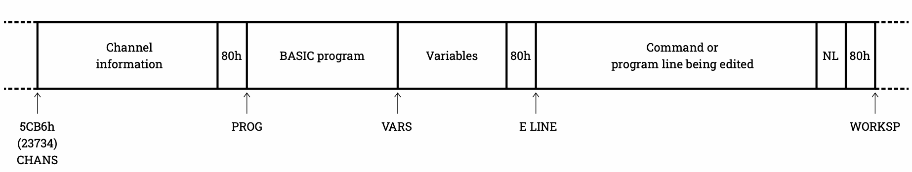
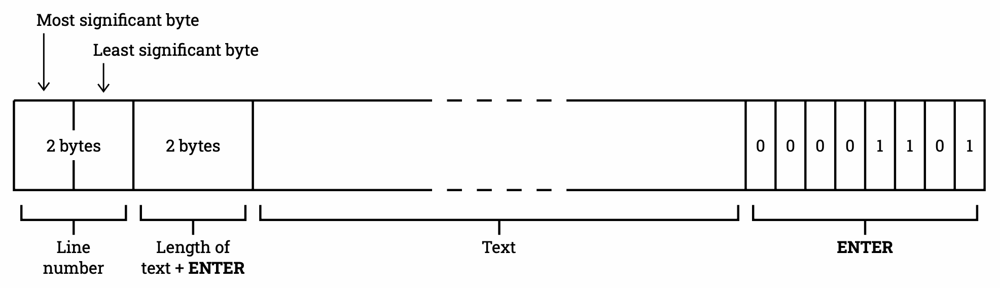

# ZX Spectrum ↔ Unicode file converter

**Author: Pedro Freire - www.pedrofreire.com**


## Quick Start

You start by extracting the files you want to convert from TAP/TZX/DSK/etc.

* Extract from DSK: https://github.com/muckypaws/AmstradDSKExplorer
* Extract from TAP/TZX: https://shredzone.org/docs/tzxtools/index.html


### Convert ASM to Unicode

To convert a [HiSoft GEN Assembler](https://spectrumcomputing.co.uk/entry/8091/ZX-Spectrum/HiSoft_Devpac) file named `file.asm` to Unicode (plain text), run:

    python3 speccy-conv.py asm2u file.asm

The output is placed in `file.asm.txt`.

Does it have garbage at the end? You likely extracted it from DSK and didn't include the +3DOS File Header. Use the following to extract in CP/M mode:

    python3 DSKUtilV3.py -dir -ex -cpm file.dsk

`speccy-conv.py` will auto-detect the (now included) +3DOS File Header and be able to ignore the 0-127 bytes of garbage at the end.

Do you miss the line numbers in the output file? As Assembly doesn't use references to line numbers, these are meant to help with editing and listing, something modern text editors don't need. But you can generate the file with the original line numbers with:

    python3 speccy-conv.py --includeLineNumbers asm2u file.asm


### Convert BAS to Unicode

To convert a [Sinclair BASIC](https://en.wikipedia.org/wiki/Sinclair_BASIC) file named `file.bas` to Unicode (plain text), run:

    python3 speccy-conv.py bas2u file.bas

The output is placed in `file.bas.txt`.

Does it have garbage at the end? `speccy-conv.py` likely couldn't file header information that determines where the BASIC lines end and variable definitions begin. You can manually delete this garbage or re-save your program from a ZX Spectrum, but do a `CLEAR` before saving. You can also either use the fix shown above if the file was extracted from DSK, or extract the BASIC file's tape header block to a separate file (say `file.header`) and run:

    python3 speccy-conv.py --tapeHeaderFile file.header bas2u file.bas

`speccy-conv.py` will read the `file.header` and be able to ignore the variables section at the end of your BASIC program. Note that [**BASIC Program Heuristics**](#feature-basic-program-heuristics) are in place, so even without a header, it's unlikely that `speccy-conv.py` will be confused.

By default, `speccy-conv.py` will assume BASIC came from a ZX Spectrum 128K/+2/+3. If your code came from a ZX Spectrum 48K/16K, use the following:

    python3 speccy-conv.py --useSpectrum48KTokens bas2u file.bas

The only difference is how characters with code points `A3h` and `A4h` are translated to Unicode: as tokens `SPECTRUM` and `PLAY` (default 128K) or User Defined Graphics 🆃 and 🆄 (48K).

There is no support for converting Unicode back to Spectrum's Sinclair BASIC.


### Convert Unicode to ASM

To convert a Unicode (plain text) file named `file.txt` with previously converted, and perhaps edited, [HiSoft GEN Assembler](https://spectrumcomputing.co.uk/entry/8091/ZX-Spectrum/HiSoft_Devpac) code back to Spectrum format, run:

    python3 speccy-conv.py u2asm file.txt

The output is placed in `file.txt.asm`. If `file.txt` includes line numbers, they will be used in the generated output file. If not, all lines will be renumbered from 10 in steps of 10.


## Full Usage

Run the script via Python 3:

    python3 speccy-conv.py --help

On a Mac/Linux you can add executable permissions and then run the script directly:

    chmod a+x speccy-conv.py
    ./speccy-conv.py  --help

The `--help` argument lists the script's help:

    usage: speccy-conv.py [-h] [-4] [-l] [-t filenameHeader] [-3] [-s] {bas2u,asm2u,u2asm} filenameInput [filenameOutput]

    ZX Spectrum <-> Unicode file converter. Supports Sinclair BASIC (BAS) and HiSoft GEN Assembler (ASM).

    positional arguments:
    {bas2u,asm2u,u2asm}   Operation to perform, e.g.: bas2u = Sinclair BASIC to Unicode
    filenameInput         Filename of the input file to convert
    filenameOutput        Filename of the output file to generate; defaults to the same as input, with an extension added

    optional arguments:
    -h, --help            show this help message and exit
    -4, --useSpectrum48KTokens
                            Use ZX Spectrum 48K (vs 128K) BASIC tokens in the output (Unicode) file (only for bas2u)
    -l, --includeLineNumbers
                            Include line numbers in the output (Unicode) file (only for asm2u)
    -t filenameHeader, --tapeHeaderFile filenameHeader
                            Tape header filename to read (Spectrum input) or generate (Spectrum output)
    -3, --prependPlus3DosHeader
                            Prepend +3DOS File Header to the beginning of the output (Spectrum) file
    -s, --useSoftEOF      Stop parsing (Spectrum) input at Soft-EOF (1Ah), or append Soft-EOF to the end of the output (Spectrum) file

    Author: Pedro Freire - Jan 2025 - GNU General Public License - https://github.com/pfre/speccy-conv

Most arguments were described in the **Quick Start** section above.

`filenameOutput`
: You can specify an additional filename argument at the end of the command line. This argument will become the filename of the output file rather than appending a new extension to `filenameInput`.

`--prependPlus3DosHeader`
: When generating a Spectrum file (action `u2asm`), you may want a +3DOS File Header to be included so the file can be inserted into a DSK.

`--useSoftEOF`
: CP/M uses an inline character with code point `1Fh` called Soft-EOF (also known as Ctrl-Z) to determine the end of a file. If needed, `speccy-conv.py` can respect that when reading (actions `asm2u` and `bas2u`) or generate that when creating a Spectrum file (action `u2asm`). Note that this character can cause the early end of file conversion if a line number such as 287 (1**1Fh**), 543 (2**1Fh**), 7936-8191 (**1F**00h-**1F**FFh), etc. exist in the source.

Both `--tapeHeaderFile` and `--prependPlus3DosHeader` are mutually exclusive. Both generate a Spectrum BASIC Header that defines the file as `CODE 16384`. This allows you to load it into any memory address in the ZX Spectrum, from BASIC, to inspect it. And if you just `LOAD file CODE`, the default address 16384 will make the omission evident by loading the file into the screen rather than a random memory address that may crash the computer. This is not perfect, as files 7kb or more will rewrite sensitive memory areas beyond the screen and crash the computer, but at least the user visually sees what happened just before the crash.


## Features


<a id="feature-character-set"></a>
### Character Set Conversions

> TLDR Summary: `speccy-conv.py` auto-convert the ZX Spectrum character set to Unicode and back, including special characters representing each User-Defined Graphic (UDG), graphic/block characters, and tokens. It will not convert display attributes (`TAB`, `INK`, `PAPER`, etc.).

The following character set conversions are done.

| Spectrum code point  | to Unicode                   | from Unicode                    |
| :------------------- | :--------------------------- | :------------------------------ |
| 06h (`PRINT ,`)      | `\t`                         | `\t`                            |
| `\r`                 | `\n`                         | `\n`                            |
| 5Eh (`↑`, ASCII `^`) | `↑`                          | `↑`, `^`                        |
| 60h (`£`)            | `£`                          | `£`                             |
| 7Fh (`©`)            | `©`                          | `©`                             |
| 80h (empty graphic)  | U+2800 BRAILLE PATTERN BLANK | U+2800 and NO-BREAK,EN,EM,IDEOGRAPHIC SPACEs |
| 81h-8Fh (graphics)   | [Unicode Block Elements](https://en.wikipedia.org/wiki/Block_Elements) | [Unicode Block Elements](https://en.wikipedia.org/wiki/Block_Elements) |
| 90h (UDG A)          | `🅰`                          | `🅰`, `🅐`, `🄰`, `ⓐ`, `Ⓐ`     |
| 91h-A4h (UDG B-U)    | `🅱` to `🆄`                   | `🅱`, `🅑`, `🄱`, `ⓑ`, `Ⓑ` ... |
| A3h-FFh (tokens)     | *Tokens*                     | N/A                             |

UDG stands for User -efined Graphics. The selected UDG convertions allow an easy visual recognition of the UDGs in the Unicode file, and precise conversion back into Spectrum format if needed.

Each *token* has one lead/trailing space, as demonstrated by this small ZX Spectrum +3 BASIC program:
```
10 FOR c = 163 TO 255
20 PRINT c; " ["; CHR$ (c); "]"
30 NEXT c
```

The `TAB` code point (17h) and other display attribute dual-code sequences (`INK`, `PAPER`, etc.) are *not* converted.

In the two overlapping Spectrum code points A3h and A4h, the user can select whether to convert to UDGs as in the ZX Spectrums 48K/16K (using the argument `--useSpectrum48KTokens`) or convert to tokens as in the ZX Spectrums 128K/+2/+3 (default).


<a id="feature-plus3dos-header"></a>
### Automatic +3DOS File Header Detection

> TLDR Summary: `speccy-conv.py` will auto-detect and use a +3DOS File Header if one is present.

The [ZX Spectrum +3 manual](https://zxspectrumvault.github.io/Manuals/Hardware/SpectrumPlus3Manual.html#part27), part 27, "Guide to +3DOS", section "File headers", documents the +3DOS File Header:

* Bytes 0..7 - +3DOS signature - `PLUS3DOS`
* Byte 8 - 1Ah (26) Soft-EOF (end of file)
* Byte 9 - Issue number
* Byte 10 - Version number
* Bytes 11..14 - Length of the file in bytes, a 32-bit number, least significant byte in lowest address
* Bytes 15..22 - +3 BASIC header data
* Bytes 23..126 - Reserved (set to 0)
* Byte 127 - Checksum (sum of bytes 0..126 modulo 256)

This header is part of a file's data, as read by a disk-aware but Spectrum-oblivious program, such as CP/M. It contains the Spectrum BASIC Header, and in both, one finds:

* The actual length of the current file - in the +3DOS and CP/M disks' metadata, this is stored as a multiple of 128, not an exact value.
* Information necessary to properly convert Sinclair BASIC *(offset to prog)*.
* Information essential to allow a ZX Spectrum +3 to `LOAD` back the file, once it has been converted (see `--prependPlus3DosHeader` argument).

`speccy-conv.py` will read the first 128 bytes of any input Spectrum file and check:

* The +3DOS signature and Soft-EOF are present
* The Checksum is correct

If these are true, it assumes the +3DOS File Header is present and retrieves the necessary values before proceeding.


<a id="feature-tape-header"></a>
### Tape Header Support

> TLDR Summary: `speccy-conv.py` supports reading and generating tape header blocks. When reading, it auto-detects and verifies the presence of raw leading+trailing check bytes.

When the original Spectrum files are retrieved from tape (TAP/TZX/etc.), no +3DOS File Header (as described above) is present. However, a Spectrum BASIC Header exists as a preceding independent tape block.

If the user can extract this tape block to a separate file, `speccy-conv.py` can read the data in it:

* Information necessary to properly convert Sinclair BASIC *(offset to prog)*.
* Information essential to allow a ZX Spectrum to `LOAD` back the file, once it has been converted (see `--tapeHeaderFile` argument).

A new tape header block file can also be generated, as indicated previously.

`speccy-conv.py` will check the sanity of this header file in two ways:

* The file length matches 17, as expected.
* The file length matches 19, and the first byte is 00h (header block tape marker). The last byte holds a correct Checkum XOR value, as documented in [unofficial documentation](https://problemkaputt.de/zxdocs.htm#spectrumcassette).


<a id="feature-basic-program-heuristics"></a>
### BASIC Program Heuristics

> TLDR Summary: `speccy-conv.py` will auto-detect Sinclair BASIC source code end, even if no header is available.

The [ZX Spectrum +3 manual](https://zxspectrumvault.github.io/Manuals/Hardware/SpectrumPlus3Manual.html#part24), part 24, "The memory", documents the BASIC format, as it exists in the ZX Spectrum memory and is recorded on a file.

Sinclair BASIC programs start with the source lines (at *PROG*), followed (at *VARS*) by the active Variables. *PROG* and *VARS* are used as documentation labels and have no fixed value.



On a file, *PROG* is at the start of the file. However, the official documented way to tell where *VARS* starts is by using information recorded in the Spectrum BASIC Header, which states the length of the BASIC program *(offset to prog)* before the Variables section begins. The +3 BASIC Header is documented in [the ZX Spectrum +3 manual](https://zxspectrumvault.github.io/Manuals/Hardware/SpectrumPlus3Manual.html#part27), part 27, "Guide to +3DOS", section "DOS OPEN 0106h (262)".

| Byte                 | 0 | 1-2           | 3-4             | 5-6              |
| :------------------- | - | :------------ | :-------------- | :--------------- |
| Program              | 0 | *file length* | 8000h or `LINE` | *offset to prog* |
| Numeric array        | 1 | *file length* | 3=? 4=*name*    | ?                |
| Character array      | 2 | *file length* | 3=? 4=*name*    | ?                |
| `CODE` or `SCREEN$`  | 3 | *file length* | *load address*  | ?                |

Additional [unofficial documentation](https://problemkaputt.de/zxdocs.htm#spectrumcassette) documents the ZX Spectrum tape header. These are jointly called "Spectrum BASIC Headers" because it's how Sinclair BASIC generates and reads them with `SAVE` and `LOAD` commands.

| Byte                 | 0 | 1-10       | 11-12         | 13-14                  | 15-16          |
| :------------------- | - | :--------- | :------------ | :--------------------- | :------------- |
| Program              | 0 | *filename* | *file length* | 8000h..FFFFh or `LINE` | *size of prog* |
| Numeric array        | 1 | *filename* | *file length* | 3=? 4=*name*           | ?              |
| Character array      | 2 | *filename* | *file length* | 3=? 4=*name*           | ?              |
| `CODE` or `SCREEN$`  | 3 | *filename* | *file length* | *load address*         | 8000h          |

The `--tapeHeaderFile` file and the [**Automatic +3DOS File Header Detection**](#feature-plus3dos-header) in `speccy-conv.py` provide options to read such header and provide a proper Sinclair BASIC conversion. However, the header may be lost when exporting files from Spectrum to a modern computer.

`speccy-conv.py`, therefore, uses a last-resort heuristic to determine when to stop converting source lines.

All lines start with a 16-bit big-endian line number. Sinclair BASIC programs can be written with valid line numbers from 1 to 9999 (270Fh).



+3 BASIC Header documentation determines that a value of 8000h as a line number defines a special situation (no automatic start, a.k.a. no `LINE`). Additional [unofficial documentation](https://problemkaputt.de/zxdocs.htm#spectrumcassette) determines that anything between 8000h to FFFFh (i.e., anything with bit 15 set) defines this special situation.

The Z80 and Sinclair BASIC use little-endian storage everywhere *except* in the line number of the BASIC program. Being big-endian, bit 15 (and bit 14 after it) are in the very first byte of the line, or in other words, they're the left-most bits (7 and 6) of the first byte.

Even though there's no specific separator value between the BASIC program and *VARS*, the Variables section, all documented variable structures are defined as having the first byte with either bit 7 or bit 6 set (1). No variable structures have both bits clear (0).

| Variable                     | First byte in binary  |
| :--------------------------- | :-------------------- |
| Numeric (single letter name) | `011xxxxx` ...        |
| Numeric (long name)          | `101xxxxx` ...        |
| Numeric array                | `100xxxxx` ...        |
| `FOR`..`NEXT`                | `111xxxxx` ...        |
| String (single letter name)  | `010xxxxx` ...        |
| Character array              | `110xxxxx` ...        |

This means `speccy-conv.py` can read the line number from a Sinclair BASIC program line and act in this way:

* Bits 15 and 14 are clear (0), i.e., this is a 16-bit value from 0000h to 3FFFh (16383): this represents a valid Sinclair BASIC program line number (1-9999).
* One of bits 15 or 14 is set (1), i.e., this is a 16-bit value from 4000h to FFFFh: this is a Variable structure; we've found *VARS* and can stop the BASIC program conversion. Note that the special values for line numbers, 8000h-FFFFh, fall in this range.


<a id="feature-assembly-leading-length"></a>
### Assembly Leading Length Heuristics

> TLDR Summary: `speccy-conv.py` will check if the first two bytes of an Assembly file match the 16-bit value of the size of file length and skip them if this is the case.

The kind people from [Planeta Sinclair](http://planetasinclair.blogspot.com) helped me recover my old ZX Spectrum +3 disks in January 2025. In some HiSoft GEN Assembler files, there were two extra bytes at the beginning of the file that the latest version of GEN Plus 3 could not understand. I don't know if those bytes were added during the disk recovery process or recorded there by some old version of GEN that I was using at the time. However, I realised they always matched a 16-bit number with the length of the file.

`speccy-conv.py` will, therefore, check if the first two bytes recorded store such a value and skip them if this is the case. It's unlikely that this is a false positive, as that's the position for the first 16-bit line number, which is typically 1 or 10 and unlikely to match the file length.


## Motivation

This project began when the kind people from [Planeta Sinclair](http://planetasinclair.blogspot.com) recovered data from my old ZX Spectrum +3 disks, which were converted into Spectrum disk image (DSK) files.

From there, I extracted some program files. On my Mac, they could not be easily read in a text editor, as they hold binary data. I found an online script to convert Sinclair BASIC to plain text, but I couldn't find one for my HiSoft GEN Assembler files. I could find converters for other assemblers that didn't work on my files but none for HiSoft's. I wanted to recover some of my old Z80 Assembly code for posterity.

Opening my files with a hex editor revealed a simple format. I could write my very own script.

I hadn't used Python before, but I was inspired by how easy it was to run other authors' scripts ([to extract files from DSK files](https://github.com/muckypaws/AmstradDSKExplorer?tab=readme-ov-file), for instance) on my Mac. So, I asked ChatGPT for the first sample version of this script. It gave me 60 working lines of code. This inspired me to expand the feature set manually to the over 1100-line script you see now.

Retro-computing rules :-)
